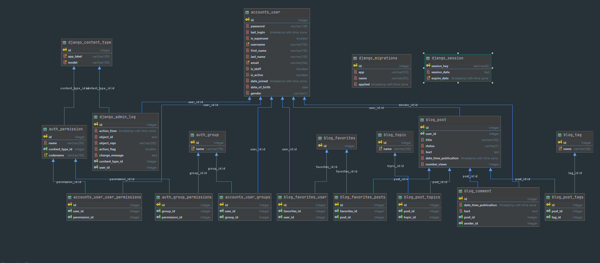

**Project "Collective Blog"**

The blog application is designed to enable the user to publish their articles, read them and gain new knowledge.

Technologies used:
- python version 3.8.5
- django version 3.1.1
- django-crispy-forms version 1.9.2
- postgresql version 12.2
- bootstrap version 4
    

